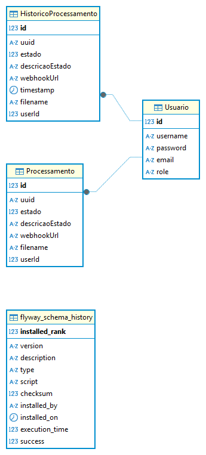
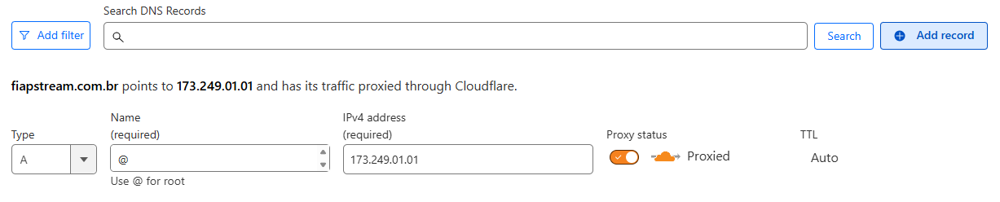
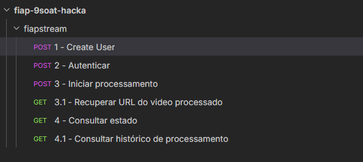

# fiapstream-producer

[]()

## Objetivo

API para o projeto de Hackaton da pós-tech FIAP, turma 9SOAT.  
Essa API é responsável por orquestrar os pedidos de processamento de vídeo recebidos, encaminhando os pedidos ao serviço de processamento
e realizando o controle de estados e alarmes.

## Arquitetura orientada a eventos do projeto FiapStream


https://www.figma.com/board/tl9T7OLsfZC7N6aapHnGb5/Projeto-Processador-Video-FIAP?node-id=6-7&t=rKJTJTmBopgJdaO7-1

## Arquitetura do Banco de Dados



## Configuração

Para realizar a configuração do projeto, é necessário ter a CLI do `docker` com o plugin `docker compose` instalado.  
Primeiramente, inicialize um arquivo `.env` na pasta raiz do projeto, e insira esse conteúdo:

```
#usuario do sistema de email
EMAIL_SENDER=meugmail@gmail.com
#senha do sistema de email
EMAIL_PASSWORD=minhasenha@123
# access ID da AWS
AWS_ACCESS_KEY_ID=213921d...
# secret_key da AWS
AWS_SECRET_ACCESS_KEY=12391239123...
# session_token da AWS
AWS_SESSION_TOKEN=12319d12d..
# Usuario do MySQL, 'fiap' por padrão
MYSQL_USER=fiap
# Senha do MySQL 'fiap' por padrão
MYSQL_PASSWORD=fiap
# Nome do bucket criado no serviço de S3, 'fiap-9soat-bucket' por padrão.
S3_BUCKET_NAME=fiap-9soat-bucket
# Credenciais do RabbitMQ. Substituia após a configuração da sua instância!
RABBITMQ_USER=guest
RABBITMQ_PASSWORD=guest
```

As credenciais da AWS podem ser obtidas atráves do arquivo `~/.aws/credentials`, caso você tenha o `AWS CLI` configurado.

É importante que seja especificado o arquivo `docker-compose.prod.yml` na subida, já que essa versão sobe e expõe todos os serviços
necessários. Esse deploy vai expor a aplicação principal na porta `:80`, utilizando Nginx.  
Isso significa que em ambiente local a aplicação se encontra disponível na url `http://localhost`. 

### Configuração

Antes de realizar chamadas nas aplicações, é necessário terminar a configuração dos componentes:

#### S3

É necessário configurar o serviço de S3 para que seja acessível com as credenciais especificadas.  
Siga [esse guia](https://docs.aws.amazon.com/AmazonS3/latest/userguide/GetStartedWithS3.html) para realizar a configuração inicial do S3 do bucket na AWS.  
Ao término da configuração, lembre-se de criar os endpoints de gateway necessários para viabilizar o acesso externo ao bucket, referência [nesse guia](https://docs.aws.amazon.com/pt_br/vpc/latest/privatelink/vpc-endpoints-s3.html).

Recomendamos utilizar o nome `fiap-9soat-bucket` na criação do bucket. Caso outro nome tenha sido especificado, lembre-se de atualizar a variavel `S3_BUCKET_NAME` no arquivo `.env`.

#### RabbitMQ

Por padrão, inicializamos as credenciais de inicialização do RabbitMQ (`guest`). Recomendamos que seja criado um novo usuario e senha após a subida do projeto, atráves da interface gráfica do RabbitMQ (`http://localhost/rabbitmq`).  
Após criação do usuario, lembre-se de atualizar as variaveis `RABBITMQ_USER` e `RABBITMQ_PASSWORD` corretamente.  
Caso o log da(s) API(s) esteja apresentando erros de conexão ou autenticação, pode ser que o usuario padrão (`guest`) esteja mal configurado.  
Recomendamos criar um usuario novo com todas as permissões necessárias no dashboard do RabbitMQ.  

### Deploy

Com a configuração feita, basta inicializar o deploy com o `docker compose`:

```shell
docker compose -f docker-compose.prod.yml up -d
```

### Produção, SSL e dominios

#### Utilizando Docker Swarm
Em ambientes produtivos, recomendamos configurar o modo [Docker Swarm](https://docs.docker.com/engine/swarm/) no servidor de aplicação.    
O Docker Swarm aceita a mesma configuração que o Docker Compose, e permite o gerenciamento, controle de escalabilidade e monitoração de forma simplificada.  
O Swarm é uma alternativa simplificada ao sistema do Kubernetes.

Recomendamos utilizar uma solução para facilitar o gerenciamento do Docker Swarm, como o [Portainer](https://www.portainer.io/), 
que possui um tier gratuito com 3 nodes (maquinas), ou com 5 nodes para projetos de código aberto.

Após a configuração do Docker Swarm, basta executar o deploy do arquivo compose como uma Stack:
```shell
docker stack deploy --compose-file docker-compose.prod.yml fiapstream
```

#### Cloudflare como CDN gratuito
Para expor a aplicação na internet, recomendamos o uso de um CDN como o [Cloudflare](https://cloudflare.com), que possui um 
tier gratuito extremamente generoso.  
É importante ressaltar que é necessário obter um dominio para expor a aplicação dessa forma. É incomum o uso de 
IP direto com requisições HTTPS, então esse requisito é obrigatório.  
Com o domínio em mãos, basta apontar o registro para o DNS da Cloudflare, e em seguida adicionar um registro do 
tipo A apontando para o IP do servidor:  



Seguindo essas recomendações, você pode disponibilizar sua própria instância do `fiapstream` de forma segura e escalável 
para todos na Internet!

## Utilização
Atenção: Necessário ter feito toda a configuração do passo [Configuracao](#configuração)!

### Coleção Postman/Bruno
A maneira recomendada de testar a API é baixar a coleção do Postman/UseBruno disponibilizada aqui.

As operações na coleção estão ordernadas por número, explicando a ordem comum que as requisições devem seguir.



Utilize o arquivo `fiapstream-bruno.json` caso esteja utilizando `UseBruno`, e o arquivo `fiapstream-postman.json` caso 
esteja utilizando o `Postman`.

### Swagger Docs
Também é possível acessar toda a documentação da API através da interface do Swagger Docs, que fica disponível na url
`https://localhost/q/docs` após a execução do deploy.  
A desvantagem desse método é que não é possível explicitar a ordem dos endpoints.

